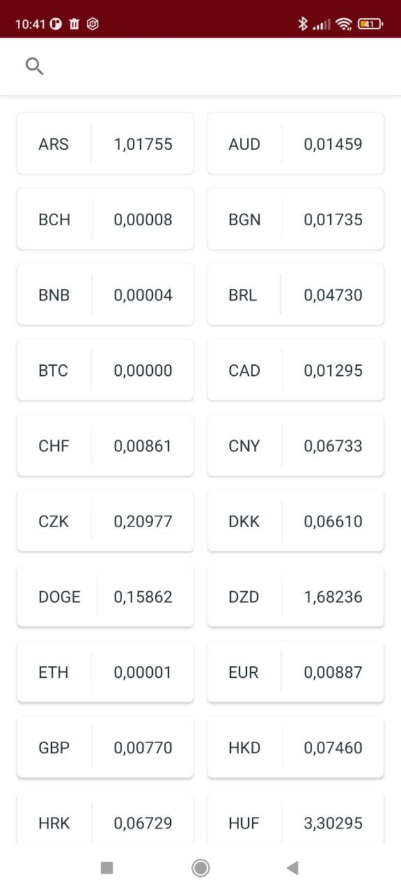
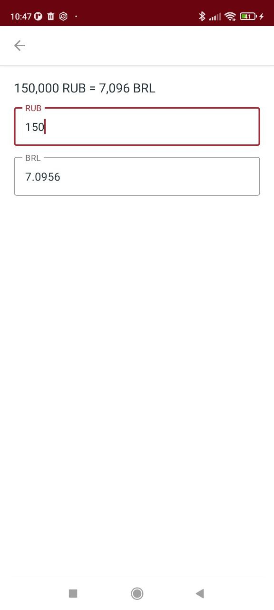

# Convertify

Это небольшое приложение для конвертации валют, которое позволяет пользователям быстро и легко переводить суммы из одной валюты в другую, и наоборот.

Приложение основано на API от [AbstractAPI](https://www.abstractapi.com/api/exchange-rate-api), которое обеспечивает точные и актуальные данные о курсах валют.

Convertify поддерживает следующие функции:
* Получение списка валют относительно рубля на текущую дату
* Фильтрация и поиск валюты по её коду
* Конвертацию суммы из рублей в выбранную валюту, и наоборот

***
# Используемые технологии
- Язык программирования: Kotlin
- Архитектура: MVVM
- DI: Dagger-Hilt
- Network: OkHttpClient, Retrofit
***
# Реализованные экраны
<table style="width:100%">
  <tr>
    <th>SplashScreen</th>
    <th>HomeScreen</th>
  </tr>
  <tr>
    <td></td>
    <td></td>
  </tr>
  <tr>
    <th>LoadingScreen</th>
    <th>NetworkDisableScreen</th>
  </tr>
  <tr>
    <td></td>
    <td></td>
  </tr>
  <tr>
    <th>FoundCurrencyScreen</th>
    <th>NotFoundCurrencyScreen</th>
  </tr>
  <tr>
    <td></td>
    <td></td>
  </tr>
  <tr>
    <th>ConverterScreen</th>
  </tr>
  <tr>
    <td></td>
  </tr>
</table>